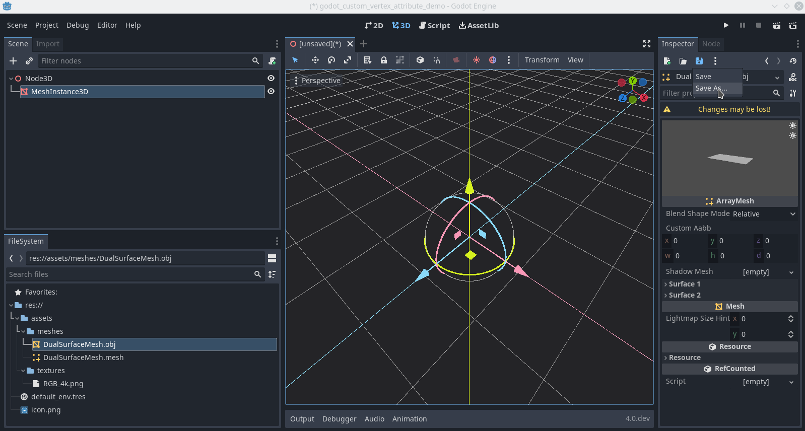

demo on how to use custom vertex attributes for indexing texture arrays for mesh surfaces.
related to the godot patch available at :
https://github.com/thenegativehunter2/godot/tree/custom_vertex_attribute

steps :
1. first save your mesh resource so you can modify it.

2. attach your script to the new mesh (you can save again if you want to keep it attached, but beware the changes the script makes may also be saved)

3. alter the floating point array that was exported via the script to set different indexes for different surfaces

how it works :
in the vertex shader there is 4 custom vec4 (4D vector of 32 bit floating point numbers). you can access them via `CUSTOM0`, `CUSTOM1`, `CUSTOM2` and `CUSTOM3`.
you can use a `MeshDataTool` and call the functions like `set_vertex_custom0` with a Color as input to alter the data. then you can commit the changes to the mesh.

the get functions (for example `get_vertex_custom0`) can also be used to retrieve the vertex's custom attribute as a `Color`

keep in mind that in godot 4 the option to remove a single surface from an `ArrayMesh` seems to have been removed so you will need to recommit the entire mesh. even the surfaces you don't alter.
